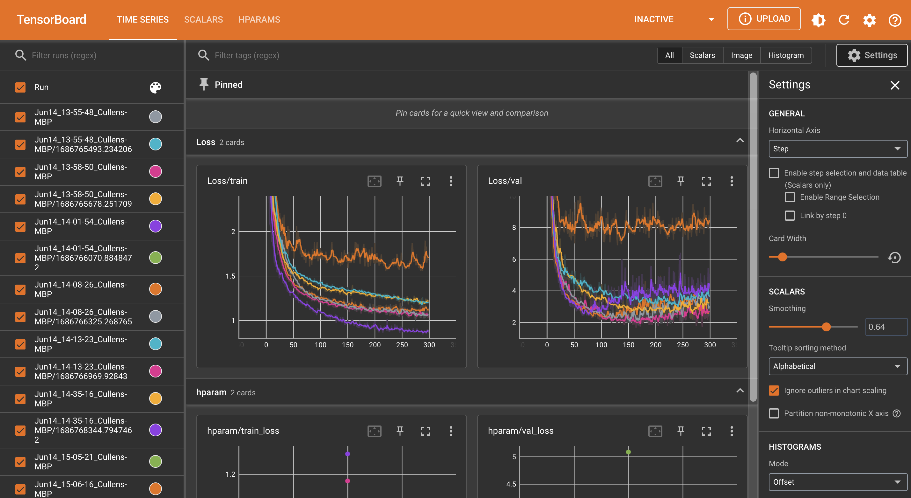

# Recurrent Approaches to Time Series

State-of-the-art time series prediction models typically incoporate some layer of recurrent nature. This repo demonstrates the differences between using a Vanilla RNN and an LSTM for time series prediction.

## Data

The dataset used is derived from a store-sales dataset from Kaggle. The data is zipped in the `data` folder and can be accessed by decompressing this folder. The data is parsed by the `time_series_dataset.py` file in the modeling folder.

## Viewing Results and Running Models

The jupyter notebooks located in the `src/models/notebooks/` folder can be run in order to initiate training for each of the models. Tensorboard results are saved in the `/notebooks/runs` folder, and can be accessed by running

```bash
cd src/models/notebooks/
tensorboard --logdir=runs
```

which will then display modelling using a local host.

